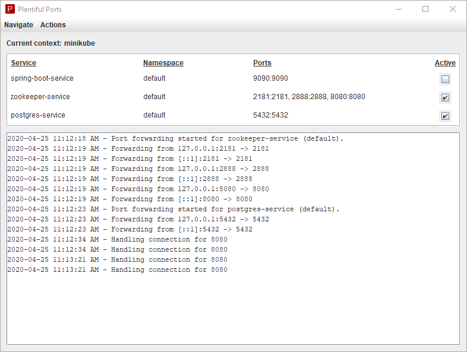

# plentiful-ports

plentiful-ports is a java project to facilitate running multiple instances of the `kubectl port-forward service/some-service` command.

* An installation of kubectl is required. Check that it's installed by running `kubectl version` from a command line.
* Forwarding is run against kubectl's current context. The current context is displayed within the UI.
* Services and ports are configured through the settings JSON (defaults are created when running the application for the first time).
* Settings files and logs can be found in `[USER HOME]/.plentiful-ports`.
* Each configured service will run the kubectl port-forward command within a separate thread.

  

## Usage

The application is released as an executable jar and can be downloaded from the GitHub Releases page.  Windows users should be able to double click the jar.

## Roadmap

* Allow changing the settings without having to manually manipulate the JSON.
* Allow changing kubectl's current context through the UI.
* Add support for having multiple settings files for better organization of groups of services. One example might be separate groups of services for project A and project B. The user could select the current group through the UI.

## License
[MIT](https://choosealicense.com/licenses/mit/)